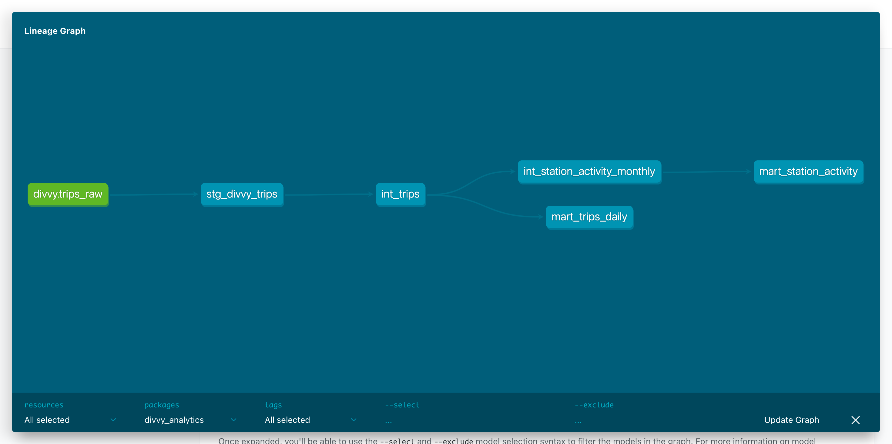
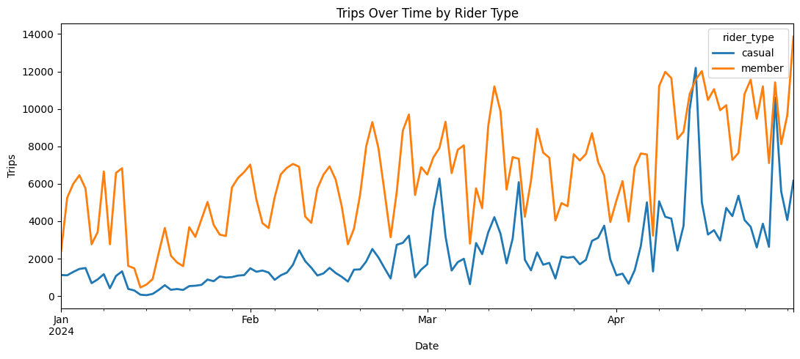
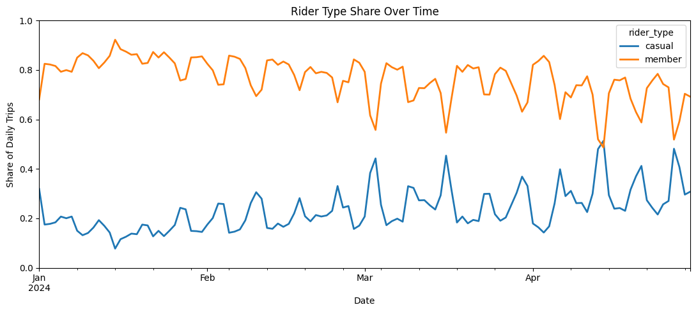
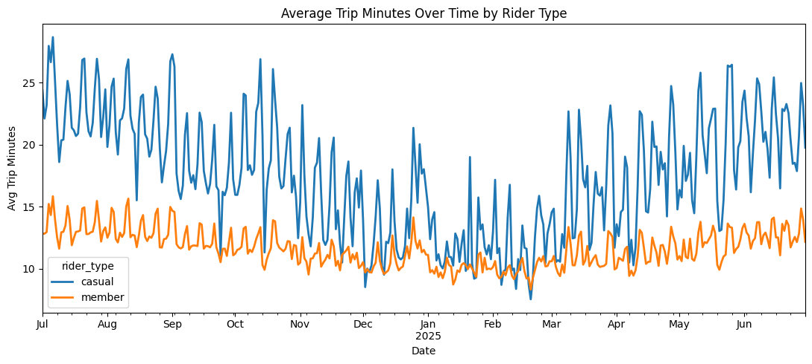
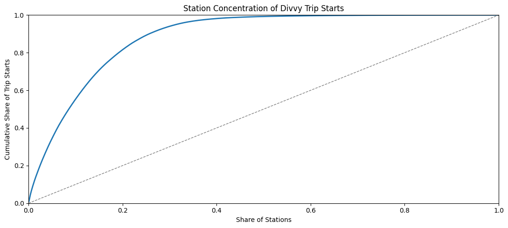

# Divvy Analytics Portfolio Project

This project ingests Chicago Divvy trip data into Postgres, cleans it into a staging model, and builds analytical outputs for KPI exploration.

The project now includes the original SQL-based workflow, a newer dbt analytics layer for model dependencies, tests, and documentation, and a local Airflow orchestration extension.

## dbt Analytics Layer

dbt Core workflow that owns the full transformation flow from the raw landing table to analytics-ready models: source (raw) → staging (view) → intermediate (incremental) → marts.

### dbt model flow

```text
raw.trips_raw  (source, all TEXT)
        ↓ source()
analytics_dbt.stg_divvy_trips              (view — defines a valid trip)
        ↓ ref()   ← the only scan of raw, filtered to one source_month
analytics_dbt.int_trips                    (incremental, trip grain, typed)
        ↓ ref()                     ↓ ref()
analytics_dbt.mart_trips_daily     analytics_dbt.int_station_activity_monthly
(incremental, daily grain)         (incremental, month × station grain)
                                          ↓ ref()
                                   analytics_dbt.mart_station_activity
                                   (table, all-time rollup)
```

Each monthly run touches only that month's data and scans `raw.trips_raw` exactly once, mirroring how ingestion replaces one `source_month` at a time. This demonstrates the scaling pattern used on large warehouses — at local data volumes the wall-clock savings are trivial.

### dbt lineage graph

The dbt docs lineage graph shows the dependency flow from the raw source through the staging view and intermediate models into the marts.




### dbt models

- `stg_divvy_trips`: staging view over `raw.trips_raw` and the source of truth for what counts as a valid trip (typed casts, `member`/`casual` normalization, 1-minute-to-24-hour validity filters). The cleaning logic is a faithful port of the legacy `sql/10_stg_trips.sql`.
- `int_trips`: trip-grain incremental table that materializes the staging view one `source_month` at a time (delete+insert partition replace). It deliberately parallels the legacy `analytics.stg_trips` table — same architecture, now with lineage, tests, docs, and incremental loading. The only model that scans raw; key data tests (`ride_id`, `started_at`, `member_casual`) live here.
- `int_station_activity_monthly`: station activity per `(source_month, start_station_name)`, incremental delete+insert.
- `mart_trips_daily`: daily trip metrics, incremental on `trip_date`.
- `mart_station_activity`: all-time station rollup table over the monthly intermediate, used for station concentration analysis.

Grain determines incremental strategy: the daily and month × station grains map cleanly onto month-sized batches, so those models are incremental; the all-time station mart needs global aggregates (a window percentage, all-time min/max), so it is rebuilt as a cheap rollup over the already-aggregated monthly intermediate.

The original SQL files are kept as the frozen first version of the pipeline. The two layers are now fully independent: dbt reads `raw.trips_raw` directly, and the SQL scripts are run manually only.

### Common dbt commands

From the `dbt/` directory:

```bash
dbt debug
dbt run --full-refresh                            # first run / rebuild all months
dbt run --vars '{"source_month": "202401"}'       # incremental: process one month
dbt test
dbt docs generate --vars '{"source_month": "202401"}'
dbt docs serve
```

Incremental runs require the `source_month` var (`YYYYMM`); a missing var fails with a clear `Required var 'source_month'` error. `dbt parse` and `dbt test` never need it. `dbt compile` and `dbt docs generate` do need it once the incremental tables exist (any loaded month works — it only affects compiled SQL text). dbt also expects `raw.trips_raw` to exist: run ingestion at least once first.

## Airflow Orchestration

Local Airflow extension for orchestrating the existing Divvy pipeline. The DAG lives at `airflow/dags/divvy_pipeline.py` and coordinates the current Python ingestion and dbt steps without replacing that workflow.

```text
check_raw_files
  → load_raw_trips
  → dbt_run
  → dbt_test
  → summarize_outputs
```

The DAG is rerunnable for a selected `source_month`: raw ingestion replaces rows for that month, and dbt's incremental models delete+insert the same month's partitions, so re-triggering an already-loaded month produces identical results. A boolean `full_refresh` parameter (default `false`) makes `dbt_run` rebuild the incremental models from scratch with `--full-refresh`. The legacy SQL scripts are no longer part of the DAG.

To run it locally, start Postgres from the project root:

```bash
docker compose up -d
```

Then start Airflow:

```bash
cd airflow
docker compose --env-file ../.env up --build -d
```

Open `http://localhost:8080`, log in with `admin / airflow`, and trigger the `divvy_pipeline` DAG through the UI. You can also trigger it from the Airflow folder with:

```bash
docker compose --env-file ../.env exec airflow airflow dags trigger divvy_pipeline --conf '{"source_month":"202401"}'
```

To stop Airflow:

```bash
docker compose --env-file ../.env down
```

Then stop Postgres from the project root:

```bash
docker compose down
```

See `airflow/README.md` for more detailed Airflow setup and usage notes.

## How to run

1. Start Postgres:

   ```bash
   docker compose up -d
   ```

2. Activate the virtual environment:

   ```bash
   source .venv/bin/activate
   ```

3. Load data for a month, for example January 2024:

   ```bash
   python ingestion/load_divvy_month.py 202401
   ```

4. Run dbt models and tests (first run builds everything; later runs process one month incrementally):

   ```bash
   cd dbt
   dbt run --full-refresh
   dbt run --vars '{"source_month": "202401"}'
   dbt test
   ```

5. Optional: generate and view dbt docs:

   ```bash
   dbt docs generate --vars '{"source_month": "202401"}'
   dbt docs serve
   ```

6. Optional (legacy reference): run the original SQL models — the dbt layer no longer depends on them:

   ```bash
   cd ..
   psql "$DATABASE_URL" -f sql/00_init.sql
   psql "$DATABASE_URL" -f sql/10_stg_trips.sql
   psql "$DATABASE_URL" -f sql/30_mart_trips_daily.sql
   ```

7. Run KPI queries:

   ```bash
   psql "$DATABASE_URL" -f sql/20_kpis.sql
   ```

## Key outputs

### Original SQL models

- `analytics.stg_trips`:
  - Cleaned trip-level model from `raw.trips_raw`.
  - Standardized rider type (`member` / `casual`).
  - Derived fields like `duration_seconds`, `started_date`, and `started_month`.
  - Filters to plausible rides between 1 minute and 24 hours where `ended_at > started_at`.

- `analytics.mart_trips_daily`:
  - Daily aggregated mart at grain: `(started_date, started_month, rider_type)`.
  - Includes `trips` and `avg_trip_minutes` for trend reporting.

### dbt models

- `analytics_dbt.stg_divvy_trips`:
  - Staging view over `raw.trips_raw`; the source of truth for what counts as a valid trip.
  - Typed casts, standardized `member_casual` rider type, derived duration and date fields.

- `analytics_dbt.int_trips`:
  - Trip-grain incremental table materializing the staging view one `source_month` at a time.
  - Deliberately parallels the legacy `analytics.stg_trips` — same architecture, with lineage, tests, docs, and incremental loading.
  - Carries the dbt tests for key fields like `ride_id`, `started_at`, and `member_casual`.

- `analytics_dbt.int_station_activity_monthly`:
  - Station activity per `(source_month, start_station_name)`, incremental.

- `analytics_dbt.mart_trips_daily`:
  - Daily trip metrics, incremental on `trip_date`.
  - Includes total trips, member trips, casual trips, and average trip duration.

- `analytics_dbt.mart_station_activity`:
  - All-time station-level trip start metrics rolled up from the monthly intermediate.
  - Supports station concentration and top-start-station analysis.

### KPI query set

The KPI query file `sql/20_kpis.sql` includes:

- Trips by month
- Member vs casual trips by month
- Trips by day of week
- Trips by hour
- Average and median trip duration by rider type
- Top 20 start stations

## Visuals

These charts come from `notebooks/01_divvy_eda.ipynb` and summarize rider volume, rider mix, trip duration trends, and station activity.

### Trips Over Time by Rider Type



### Rider Type Share Over Time



### Average Trip Minutes Over Time by Rider Type



### Station Concentration of Divvy Trip Starts


